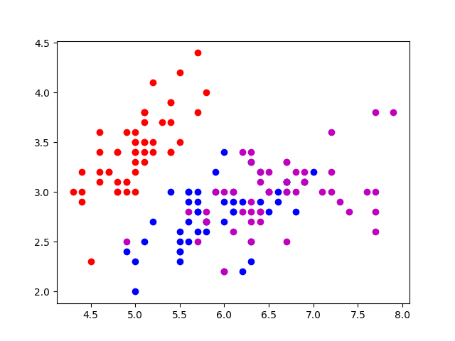
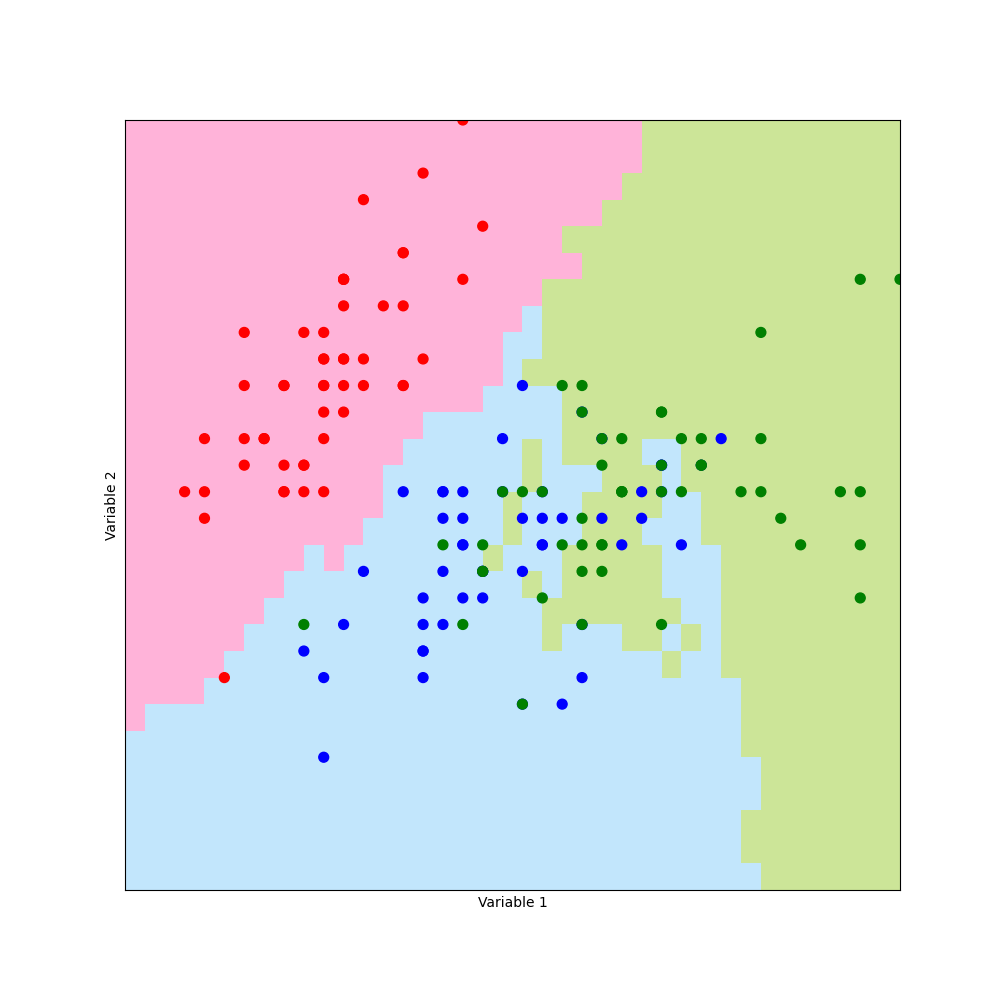

<h1>CustomKNN</h1>
In this project, I created my own K Nearest Neighbour classify and compared it performance with Scikit Learn KNN implementation. I tested the performance of the classify using iris dataset
<h2>Quickstart</h2>
To reproduce this code, follow below instructions. Make sure you have python 3 installed
<ul>
  <li><pre> git clone https://github.com/ekmahama/CustomKNN.git </pre></li>
  <li><pre> cd CustomKNN </pre></li>
  <li><pre> pip install requirements.txt</pre></li>
  <li><pre> python KNN_Classify.py </pre></li>
</ul>
<h2>Package dependencies </h2>
<ul>
  <li>matplotlib==3.4.2</li>
  <li>numpy==1.20.3</li>
  <li>pyparsing==2.4.7</li>
  <li>scikit-learn==0.24.2</li>
  <li>scipy==1.6.3</li>
</ul>

<h2>Results </h2>
<ul>
  <li>sk_knn and custom_knn agree by: 96.0</li>
  <li>custom_knn_accuracy: 83.33333333333334</li>
  <li>sk_knn_accuracy: 84.66666666666667</li>
</ul>
<h2>Plots of dataset and results on 2D grid </h2>

Dataset grid 

Prediction grid 

